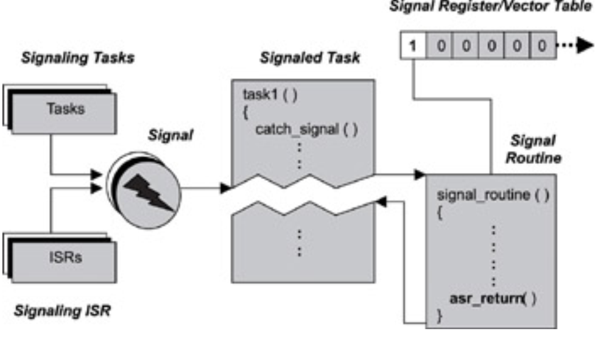

## Signal
- A signal is a software interrupt that is generated when an event has occurred.
- The difference between a signal and a normal interrupt is that signals are so-called software interrupts, which are generated via the execution of some software within the system, normal interrupts are usually generated by the arrival of an interrupt signal on one of the CPU s external pins. 
- They are not generated by software within the system but by external devices.
- The number and type of signals defined is both system-dependent and RTOS-dependent. An easy way to
understand signals is to remember that each signal is associated with an event. 
- The event can be either unintentional, such as an illegal instruction encountered during program execution, or the event may be intentional, such as a notification to one task from another that it is about to terminate.
- When a signal arrives, the task is diverted from its normal execution path, and the corresponding signal routine
is invoked.
- The terms signal routine, signal handler, asynchronous event handler, and asynchronous signal
routine are interchangeable.
- Each signal is identified by an integer value, which is the signal number or vector number.
- When a task is prepared to handle a signal, it is often said, the task is ready to catch the signal. 
- The task can provide a signal handler for each signal to be processed, or it can execute a default handler that the kernel provides. It is possible to have a single handler for multiple types of signals.

- Signals can be ignored, made pending, processed (handled), or blocked
- The signals to be ignored by the task are maintained in the ignored signals set. Any signal in this set does not
interrupt the task.
- Other signals can arrive while the task is in the midst of processing another signal. The additional signal
arrivals are kept in the pending signals set. The signals in this set are raised to the task as soon as the task
completes processing the previous signal.
- A fourth kind of response to a signal is possible. In this case, a task does not ignore the signal but blocks the
signal from delivery during certain stages of the task s execution when it is critical that the task not be
interrupted.
- Blocking a signal is similar to the concept of entering a critical section.
- The task can instruct the kernel to block certain signals by setting the blocked signals set. The kernel does not deliver any signal from this set until that signal is cleared from the set.
