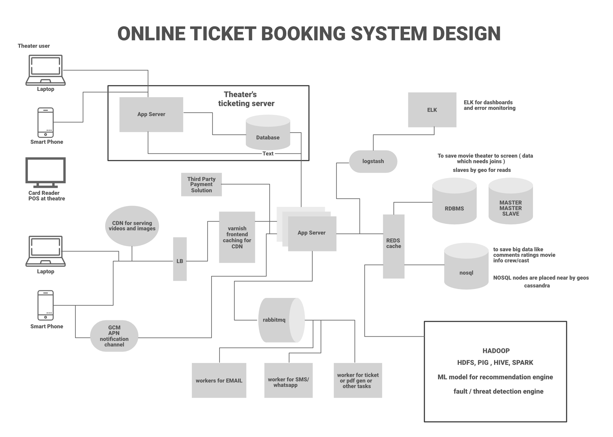
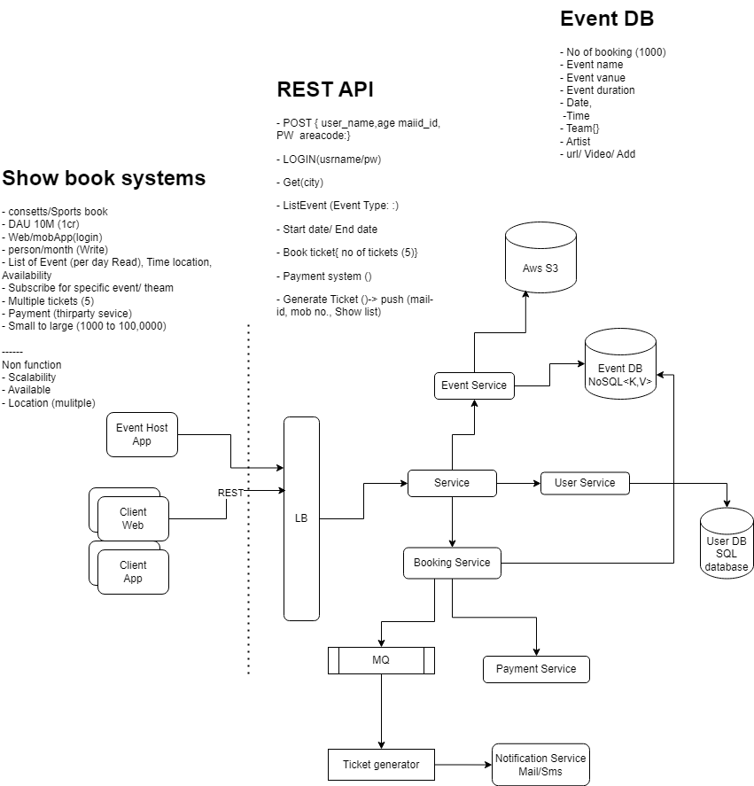

### Design BookMyShow
It’s really easy to search for your favorite movie in a theatre, check the seat availability, and, book the ticket on the BookMyShow app within just 5-10 minutes without much effort… 

We all know the services of BookMyShow (after all we all love to watch the movies…lolz) and how it works, but can you imagine that behind this gigantic website how engineers have used their brains to build the complex architecture of this system? 

### 1. Define Goals and Requirements
Tell your interviewer that you’re going to support the below features. If the interviewer wants to add some more features he/she will mention that. 

- The portal should list the different cities where the theatres are located. (RDBMS)
- Once the user selects the city it should display the movies released in that particular city to that user.
- Once the user selects the movie, the portal should display the cinemas running that movie and the available shows.
- Users should be able to select the show at a particular theatre & book the tickets (third-party payment support).
- Send a copy of tickets via SMS notification or Email. (workers and GCM)
- Movies suggestions when login (Hadoop and spark streaming with ML to get recommendation engine), real-time notifications to the user about new movie releases & other stuff.
- The portal should display the seating arrangement of the cinema hall to the user.
- Users should be able to select multiple seats according to their choice.
- Users should be able to hold the seats for 5-10 minutes before he/she finalized the payment.
- The portal should serve the tickets in a First In First Out manner
- Comments and rating (Cassandra)
- The system should be highly concurrent because there will be multiple booking requests for the same seat at the same time.
- The core thing of the portal is ticket bookings which means financial transactions. So the system should be secure and ACID compliant.
- Responsive design (ReactJS and Bootstrap) to run on devices of various sizes like mobile, tablet, desktop, etc.
Movie information.
### 2. How does Bookmyshow Talk to Theatres?
When you visit any third-party application/movie tickets aggregator using the mobile app or website, you see the available and occupied seats for a movie show in that theatre. Now the question is how these third-party aggregators talk to the theatres, get the available seat information, and display it to the users. Definitely, the app needs to work with the theatre’s server to get the seat allocation and give it to the users. There are mainly two strategies to allocate seats to these aggregators. 

A specific number of seats will be dedicated to every aggregator and then these seats will be offered to the users. In this strategy, some seats are already reserved for these aggregators, so there is no need to keep updating the seat information from all the theatres.
- In the second strategy, the app can work along with the theatre and other aggregators to keep updating the seat availability information. Then the ticket will be offered to the users.

### 3. How to Get The Seat Availability Information?
There are mainly two ways to get this information…  

- The aggregators can connect to the theatre’s DB directly and get the information from the database table. Then this information can be cached and displayed to the user.
Use the theatre’s server API to get the available seat information and book the tickets.
What will happen if multiple users will try to book the same ticket using different platforms? How to solve this problem? 

- The theatre’s server needs to follow a timeout locking mechanism strategy where a seat will be locked temporarily for a user for a specific time session (for example, 5-10 minutes). If the user is not able to book the seat within that timeframe then release the seat for another user. This should be done on a first come first serve basis. 

If you’re using the theatre’s server API then you will be making a lot of requests or IO-blocking calls from your server to the theatre’s server. To achieve better performance we should use async in Python or Erlangs lightweight threads or Go Coroutines in Go. 

### High-Level Architecture

#### Load Balancer
A load balancer is used to distribute the load on the server and to keep the system highly concurrent when we are scaling the app server horizontally. The load balancer can use multiple techniques to balance the load and these are… 

- Consistent Hashing
- Round Robin
- Weighted Round Robin
- Least Connection
- Frontend Caching and CDN
We do frontend caching using Varnish to reduce the load from the backend infrastructure. We can also use CDN Cloudflare to cache the pages, API, video, images, and other content. 

#### App Servers
There will be multiple app servers and BookMyShow uses Java, Spring Boot, Swagger, and Hibernate for the app servers. We can also go with Python-based or NodeJS servers (Depending on requirements). We also need to scale these app servers horizontally to take the heavy load and handle a lot of requests in parallel.  

#### Elastic Search
Elastic search is used to support the search APIs on Bookmyshow (to search movies or shows). Elastic search is distributed and it has RESTful search APIs available in the system. It can be also used as an analytics engine that works as an App-level search engine to answer all the search queries from the front end. 

#### Caching
To save the information related to the movies, seat ordering, theatres, etc, we need to use caching. We can use Memcache or Redis for caching to save all this information in Bookmyshow. Redis is open-source and it can be also used for the locking mechanism to block the tickets temporarily for a user. It means when a user is trying to book the ticket Redis will block the tickets with a specific TTL. 

#### Database
We need to use both RDBMS and NoSQL databases for different purposes. Let’s analyze what we need in our system and which database is suitable for what kind of data… 

- `RDBMS`: We have mentioned that we need ACID property in our system. Also, we have countries, cities, theatres in cities, multiple screens in these theatres, and multiple rows of seats on each screen. So here it is clear that we need a proper relationship representation. Also, we need to handle the transaction. RDBMS is fit for these cases. The portal will be read-heavy so we need to share the data by Geo or we need to use master-master slave architecture. Slaves can be used for reading and master for writing.
- `NoSQL`: We also have a huge amount of data like movie information, actors, crew, comments, and reviews. RDBMS can not handle this much amount of data so we need to use the NoSQL database which can be distributed. Cassandra can be a good choice to handle this ton of information. We can save multiple copies of data in multiple nodes deployed in multiple regions. This ensures the high availability and durability of data (if a node goes down, we will have data available in other nodes).

#### Use HDFS to run queries for analytics.
- `Async Workers`
The main task of the Async worker is to execute the tasks such as generating the pdf or png of the images for booked tickets and sending the notification to the users. For push notifications, SMS notifications, or emails we need to call third-party APIs. These are network IO and it adds a lot of latency. Also, these time-consuming tasks can not be executed synchronously. To solve this problem, as soon as the app server confirms the booking of the tickets, it will send the message to the message queue, a free worker will pick up the task, execute it asynchronously and provide the SMS notification, other notifications, or email to the users. RabbitMQ or Kafka can be used for Message Queueing Systems and Python celery can be used for workers. For browser notifications or phone Notifications use GCM/ APN. 

- `Business Intelligence and ML`
For data analysis of business information, we need to have a Hadoop platform. All the logs, user activity, and information can be dumped into Hadoop, and on top of it, we can run PIG/Hive queries to extract information like user behavior or user graph. ML is used to understand the user’s behavior and to generate movie recommendations etc. For real-time analysis, we can use Spark streaming. We can also figure out fraud detection and mitigation strategy using the Spark or Storm stream processing engine. 

- `Log Management`
ELK (ElasticSearch, Logstash, Kibana) stack is used for the logging system. All the logs are pushed into the Logstash. Logstash collects data from all the servers via Files/Syslog/socket/AMQP etc and based on a different set of filters it redirects the logs to Queue/File/Hipchat/Whatsapp/JIRA etc. 

#### Step By Step Working 
- The customer visits the portal and filters the location. To find the location we can use GPS (if it’s a mobile phone) or ISP (if it’s a laptop). Then the theatres and movies released in that theatres will be suggested to the user. Data will be provided from DB and ELK recommendation engines.

- Users select the movie and check the different timing for the movies in all the nearby theatres.

- Users select a particular date and time for a movie in his/her own choice of theatre. The available seat information will be fetched from the database and it will be displayed to the user.

- Once the user selects the available seat, BMS locks the seat temporarily for the next 10 minutes. BMS interacts with the theatre DB and blocks the seat for the user. The ticket will be booked temporarily for the current user and for all the other users using different aggregators or apps the seat will be unavailable for the next 10 minutes. If the user is failed to book the ticket within that timeframe the seat will be released for the other aggregators.

- If the user continues with the booking he/she will check the invoice with the payment option and after the payment via the payment gateway, the app server will be notified about the successful payment.

After successful payment, a unique ID will be generated by the theatre and it will be provided to the app server.
Using that unique ID a ticket will be generated with a QR code and a copy of the ticket will be shown to the user. Also, a message to the queue will be added to send the invoice copy of the ticket to the user via SMS notification or email. The ticket will have all the details such as the movie, address of the theatre, timing, theatre number, etc.
At movie time, when the customer visits the theatre the QR code will be scanned and the customer will be allowed to enter the theatre if the ID will be matched on both customer’s ticket and the theatre’s ticket.

#### APIs Needed 
- GetListOfCities()
- GetListOfEventsByCity(CityId)
- GetLocationsByCity(CityId)
- GetLocationsByEventandCity(cityid, eventid)
- GetEventsByLocationandCity(CityId, LocationId)
- GetShowTiming(eventid, locationid)
- GetAvailableSeats(eventid, locationid, showtimeid)
- VarifyUserSelectedSeatsAvailable(eventid, locationid, showtimeid, seats)
- BlockUserSelectedSeats()
- BookUserSelectedSeat()
- GetTimeoutForUserSelectedSeats()

#### RDBMS Tables 
- Place (To save the hierarchal data for any given theatre-like country, state, city, and street)
- Theatre
- Screen
- Tier (tier of seats)
- Seats
- Movie
- Offers
- Ticket
- User

#### Relationship Between RDBMS Tables:
- One to many: Place and theatre.
- One to many: Theatre and screen
- One to many: Screen and Tier
- One to many: Tier and seats
- One to one: Screen and Movie
- One to many: User and Tickets
- One to many: Tickets and Seats

#### NoSQL Tables
There will be no relationship between these tables. 
- Comments
- Ratings
- Movie Information
- Trailers or Gallery
- Artists
- Cast and Crew
- Reviews
- Analytics Data 

#### Technologies Used By Bookmyshow
- User Interface: ReactJS & BootStrapJS
- Server language and Framework: Java, Spring Boot, Swagger, Hibernate
- Security: Spring Security
- Database: MySQL
- Server: Tomcat
- Caching: In memory cache Hazelcast.
- Notifications: RabbitMQ. A Distributed message queue for push notifications.
- Payment API: Popular ones are Paypal, Stripe, Square
- Deployment: Docker & Ansible
- Code repository: Git
- Logging: Log4J
- Log Management: ELK Stack
- Load balancer: Nginx