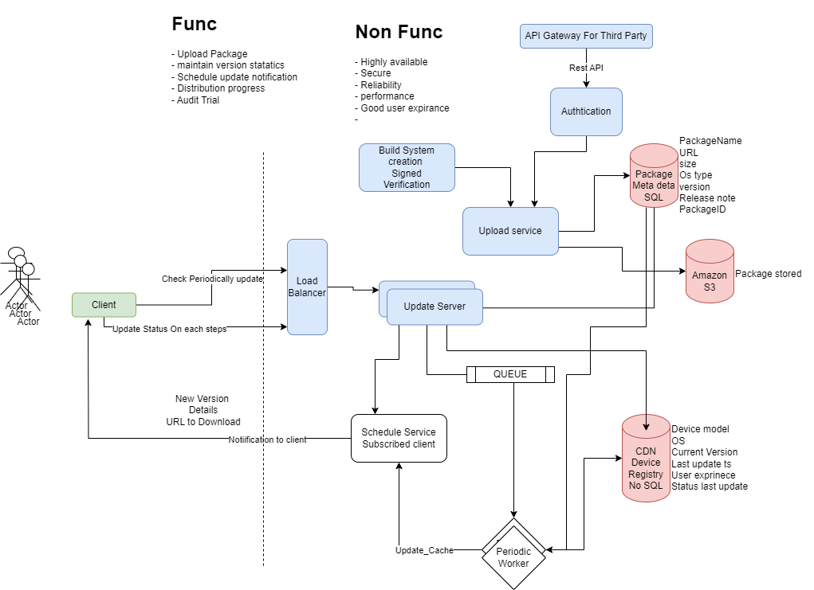

## Package Distribution system
Designing a SaaS-based security update package distribution system involves creating a platform that enables organizations to efficiently distribute security updates for software applications, operating systems, firmware, and other critical components. Here's a high-level overview of how you might approach designing such a system:

### 1. Requirements Analysis:
- `Functional Requirements`: Define the core functionalities the system should provide, such as managing multiple software products, uploading security update packages, scheduling updates, tracking distribution progress, and providing audit trails.

- `Non-Functional Requirements`: Consider factors like scalability, performance, security, reliability, compliance, and user experience.

### 2. System Architecture:
#### Components: 
Identify the key components of the system, including:

- `User Management`: Authentication and authorization mechanisms for managing users, roles, and permissions.
- `Product Management`: Functionality to manage software products, versions, and security update packages.
- `Update Scheduler`: Component to schedule update deployments, including options for immediate and scheduled deployments.
- `Distribution Infrastructure`: Backend infrastructure to distribute update packages securely and efficiently to target systems.
- `Audit Logging`: Module for logging all system activities related to update package distribution for auditing and compliance purposes.
- `API Gateway`: Expose APIs for integrating with third-party systems and clients.
- `User Interface`: Web-based dashboard or management portal for administrators to interact with the system.
#### Interactions: 
Define the interactions between components, such as:

Uploading new security update packages and associating them with software products and versions.
Scheduling update deployments and managing deployment configurations, including target systems and rollout strategies.
Monitoring distribution progress and viewing audit logs for compliance purposes.

### 3. Data Model:
Software Product Data: Design the database schema to store information about software products, versions, security update packages, users, and audit logs.

### 4. Update Distribution:
Distribution Strategy: Determine the strategy for securely distributing update packages to target systems, such as using secure channels (e.g., HTTPS), digital signatures, and encryption to ensure integrity and authenticity.

Rollback Mechanism: Implement mechanisms to rollback updates in case of failures or compatibility issues.

### 5. User Interfaces:
Admin Dashboard: Develop a web-based dashboard for administrators to manage software products, upload security update packages, schedule updates, monitor distribution progress, and view audit logs.

### 6. Integration and External Systems:
APIs: Expose RESTful APIs to allow integration with third-party systems, clients, and automation tools.

### 7. Security Considerations:
- `Authentication and Authorization`: Implement secure authentication mechanisms such as OAuth or JWT for user authentication and fine-grained access control for managing permissions.
- `Data Encryption`: Encrypt sensitive data such as update packages, credentials, and audit logs to protect against unauthorized access.
- `Secure Communication`: Ensure all communication channels between components and external systems are secure, using encryption and secure protocols.

### 8. Testing and Deployment:
- `Unit Testing`: Test individual components and functionalities using unit tests to ensure reliability and functionality.
- `Integration` Testing: Test interactions between components to verify end-to-end functionality.
- `Deployment`: Deploy the system in a production environment, ensuring scalability, reliability, and performance.

### 9. Maintenance and Support:
- `Monitoring`: Set up monitoring tools to track system performance, distribution status, and errors in real-time.
- `Maintenance`: Regularly update and maintain the system to address bugs, security vulnerabilities, and evolving requirements.

### 10. Compliance and Reporting:
- `Compliance Controls`: Implement mechanisms to ensure compliance with regulations and standards related to software updates and security (e.g., GDPR, HIPAA).

- `Reporting`: Provide reporting capabilities to generate audit trails, compliance reports, and analytics on update distribution activities.

By following these steps and considerations, you can design and implement a robust SaaS-based security update package distribution system that meets the needs of organizations for efficiently distributing security updates while ensuring security, compliance, and reliability.
