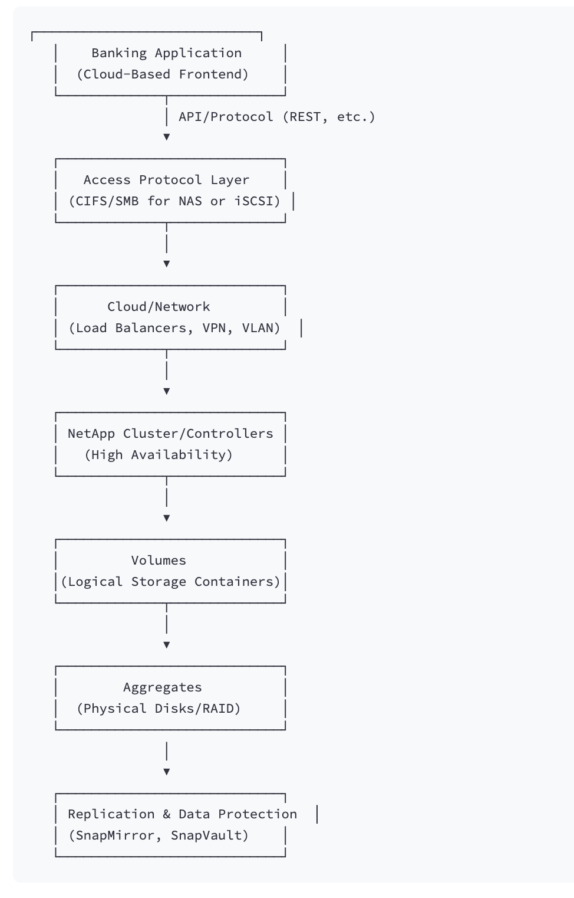

# Data Flow and Component Interactions in a NetApp Storage Solution

This document outlines how a modern cloud-based application (e.g., a banking application) interacts with NetApp storage solutions during read and write operations. The explanation follows a top-to-bottom approach—from the application layer down to the physical storage components including volumes, aggregates, replication (e.g., SnapMirror), high availability, SAN, NAS, and networking elements.

---

## 1. Application Layer

At the top of the stack, the modern application generates read and write requests. These include operations such as transaction logs, customer data updates, or balance queries.

- **Business Logic:** Validates and processes the data.
- **API Interfaces:** RESTful or GraphQL endpoints that communicate with the storage backend.
- **Middleware:** Provides caching, queuing, and load balancing.

---

## 2. Access Protocols and Networking

Depending on the data type and performance needs, the application accesses storage via various protocols:

- **NAS Protocols (CIFS/SMB, NFS):**  
  Used for file-level data access and shared file systems, ideal for storing reports or document archives.

- **SAN Protocols (iSCSI, FC):**  
  Used for block-level storage access, which is best suited for low latency, high-performance transactional data.

Networking components ensure that the requests are securely and efficiently routed:

- **Cloud Networking:**  
  Load balancers, VPNs, or direct connect links handle secure connections and routing.
- **Data Center Network:**  
  VLANs and dedicated SAN/NAS networks provide segregation and quality of service.

---

## 3. NetApp Storage Controllers and Nodes

Once the request arrives at the storage system, it is received by a NetApp cluster or storage controllers configured for high availability and load balancing.

- **High-Availability (HA) Clusters:**  
  Multiple controllers ensure that a failing node can quickly be replaced by another with minimal disruption.
- **Protocol Gateways:**  
  Translate external protocols (CIFS/SMB, NFS, iSCSI) into internal file or block operations.

---

## 4. Volumes – Logical Storage Containers

Within the NetApp storage nodes, data is organized into *volumes*. These are logical containers that abstract the physical storage.

- **Data Isolation:**  
  Different application data or tenants can be separated by using distinct volumes.
- **Access Controls:**  
  Permissions, quotas, and data protection policies are applied at the volume level.

When the application executes read or write operations, these are directed to the appropriate volume.

---

## 5. Aggregates – Physical Storage Pools

Below the logical volume, aggregates form the underlying physical storage pool.

- **Storage Pool:**  
  Aggregates are groups of multiple disks (HDDs or SSDs), often configured with RAID for performance and redundancy.
- **Performance & Resiliency:**  
  Aggregates manage disk I/O, balancing load and ensuring fault tolerance at the physical level.

Volumes are carved out from these aggregates, enabling efficient space management across multiple disks.

---

## 6. Replication and Data Protection

NetApp provides robust replication and backup features such as SnapMirror and SnapVault.

- **SnapMirror:**  
  Continuously replicates data from source volumes to target volumes at remote sites for disaster recovery.
- **SnapVault:**  
  Provides point-in-time backups that allow for rollback and archival purposes.

These mechanisms ensure that critical data, such as banking transactions, is protected and can be recovered in the event of an outage.

---

## 7. High Availability and Failover Mechanisms

High availability is integral to the overall architecture:

- **Clustered Controllers:**  
  Multiple NetApp nodes operate as a cluster to allow seamless failover.
- **Automated Monitoring:**  
  Continuous performance and health monitoring ensures swift remediation of hardware or software faults.

This design minimizes downtime and ensures continuous service availability.

---

## 8. System Design: End-to-End Flow for a Banking Application

Below is a simplified system design diagram illustrating the end-to-end data flow:

## End-to-End Process Summary

1. The application initiates a read/write request via secure API calls.
2. The request is transmitted over the network using standard protocols (e.g., CIFS for NAS or iSCSI for SAN).
3. Network components such as load balancers and dedicated VLANs route the request to a NetApp controller in a high-availability cluster.
4. The controller processes the request by mapping it to the appropriate volume.
5. The volume obtains space from its underlying aggregate – a pool of physical disks.
6. Replication technologies (like SnapMirror) ensure that the data is continuously mirrored to remote sites for disaster recovery.
7. High-availability mechanisms ensure that even in event of a failure, the application experiences minimal or no disruption.

This layered architecture efficiently serves critical applications, such as those in the banking sector, by ensuring fast data access, high performance, and robust data protection.

---