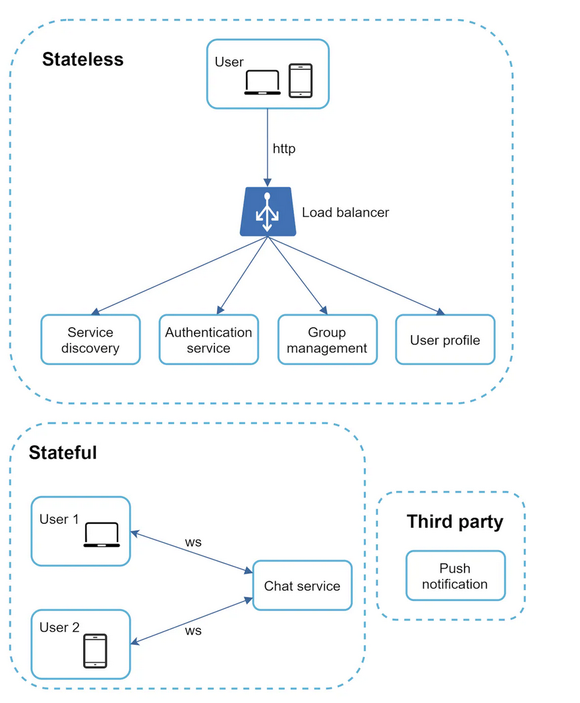

## Chat app design
- whats app
- wechat
- google hangout
- facebook messanger

### functional requirement
- one to one chat with low latency
- small group chat with max 256 memebers
- online/offline status
- supported on multiple device
- push notification

### Capacity
- 50 Millin daily active user (5 crore)

### High level Design
High-level design
WebSocket was chosen as the main communication protocol between the client 
and server for its bidirectional communication, it is important to note that everything else does not have to be WebSocket. 
In fact, most features (sign up, login, user profile, etc) of a chat application could use the traditional request/response method over HTTP. 
chat system is broken down into three major categories: stateless services, stateful services, and third-party integration.

### Scalability
- On a small scale, all services listed above could fit in one server. Even at the scale we design for, it is in theory possible to fit all user connections in one modern cloud server. The number of concurrent connections that a server can handle will most likely be the limiting factor. In our scenario, at 1M concurrent users, assuming each user connection needs 10K of memory on the server (this is a very rough figure and very dependent on the language choice), it only needs about 10GB of memory to hold all the connections on one box.

If we propose a design where everything fits in one server, this may raise a big red flag in the interviewer’s mind. No technologist would design such a scale in a single server. Single server design is a deal breaker due to many factors. The single point of failure is the biggest among them.

However, it is perfectly fine to start with a single server design. Just make sure the interviewer knows this is a starting point. Putting everything we mentioned together, Figure 8 shows the adjusted high-level design.