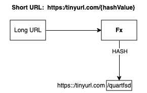
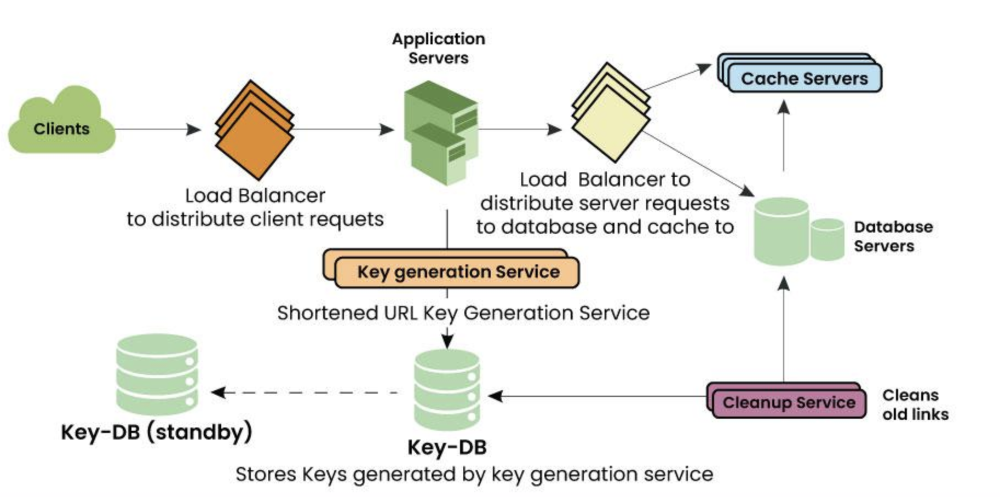

## URL shortner

You need to design this kind of web service where if a user gives a long URL then the service returns a short URL and if the user gives a short URL then it returns the original long URL. 
```html
input: https://www.geeksforgeeks.org/system-design-interview-bootcamp-guide/
ouput: http://bit.ly/3uQqImU
```

### Functional Requirement 
- Given a long URL, the service should generate a shorter and unique alias for it.
- When the user hits a short link, the service should redirect to the original link.
- Links will expire after a standard default time span.
- Let’s consider we are using 7 characters to generate a short URL. These characters are a combination of 62 characters [A-Z, a-z, 0-9] something like http://ad.com/abXdef2.

### Non-Functional Requirement
- The system should be highly available. This is really important to consider because if the service goes down, all the URL redirection will start failing.
- URL redirection should happen in real-time with minimal latency.
- Shortened links should not be predictable.

### Capacity
- lets assume service has 30M new URL shortenings per month for 5 years
`30 million * 5 years * 12 months = 1.8B` Records needs to be stored

- Consider the 
```
average long URL size of 2KB ie for 2048 characters.
Short URL size: 17 Bytes for 17 characters
created_at- 7 bytes
expiration_length_in_minutes -7 bytes

The above calculation will give a total of 2.031KB per shortened URL entry in the database.
If we calculate the total storage then for 30 M active users
total size = 30000000 * 2.031 = 60780000 KB = 60.78 GB per month. In a Year of 0.7284 TB and in 5 years 3.642 TB of data. 

```

### API Design
We can use the REST API based design approach 
- URL shortning API: Returns the short url for any long url
    ```
    POST api/v1/data/shorten
    Request: longURLString
    Response: short URL
    ```

- URL redirecting API:  This redirect to short url corresponding to long url
    ```
    GET api/v1/data/shortUrl
    Request: shortUrl String
    Response: longUrl String
    ```

STATUS Code: 301/302

- 301: requested url is permanentaly moved to the long Url
- 302: url temporary moved to long url


### Data Model

Database table can be 
- id
- shorturl
- longurl

### Database Choise
The database should be scalable to handle a large number of URLs and clicks. We can use NoSQL databases such as MongoDB or Cassandra, which can handle large amounts of data and can scale horizontally.

Let us explore some of the choices for System Design of Databases of URL Shortner:

- We can use RDBMS which uses ACID properties but you will be facing the scalability issue with relational databases.
Now if you think you can use sharding and resolve the scalability issue in RDBMS then that will increase the complexity of the system.
There are 30M active users so there will be conversions and a lot of Short URL resolution and redirections.
Read and write will be heavy for these 30M users so scaling the RDBMS using shard will increase the complexity of the design.
You may have to use consistent hashing to balance the traffics and DB queries in the case of RDBMS and which is a complicated process. So to handle this amount of huge traffic on our system relational databases are not fit and also it won’t be a good decision to scale the RDBMS. 

- So let’s take a look at NoSQL Database:
The only problem with using the NoSQL database is its eventual consistency.
We write something and it takes some time to replicate to a different node but our system needs high availability and NoSQL fits this requirement.
NoSQL can easily handle the 30M of active users and it is easy to scale. We just need to keep adding the nodes when we want to expand the storage. 

### URL Encoding 

To convert a long URL into a unique short URL we can use some hashing techniques like Base62 or MD5. We will discuss both approaches. 
1. `Base62 Encoding`
- Base62 encoder allows us to use the combination of characters and numbers which contains A-Z, a-z, 0–9 total( 26 + 26 + 10 = 62).
- So for 7 characters short URL, we can serve 62^7 ~= 3500 billion URLs which is quite enough in comparison to base10 (base10 only contains numbers 0-9 so you will get only 10M combinations).
- We can generate a random number for the given long URL and convert it to base62 and use the hash as a short URL id. 

2. `MD5 Encoding`
- MD5 hash generates 128-bit long output so out of 128 bits we will take 43 bits to generate a tiny URL of 7 characters.
- MD5 can create a lot of collisions. For two or many different long URL inputs we may get the same unique id for a short URL and that could cause data corruption.
- So we need to perform some checks to ensure that this unique id doesn’t exist in the database already. 

### Diagram



