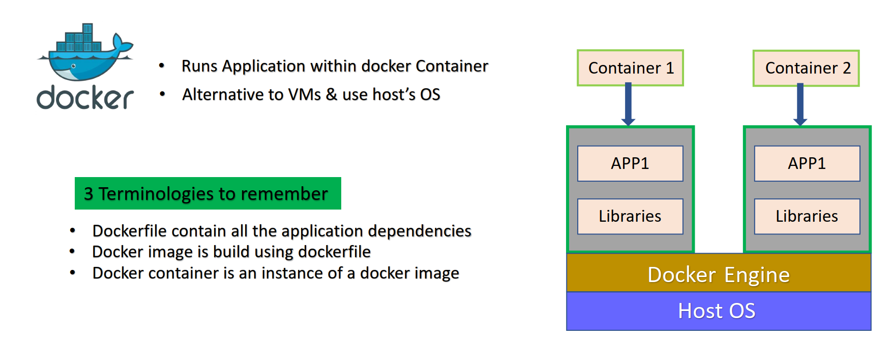
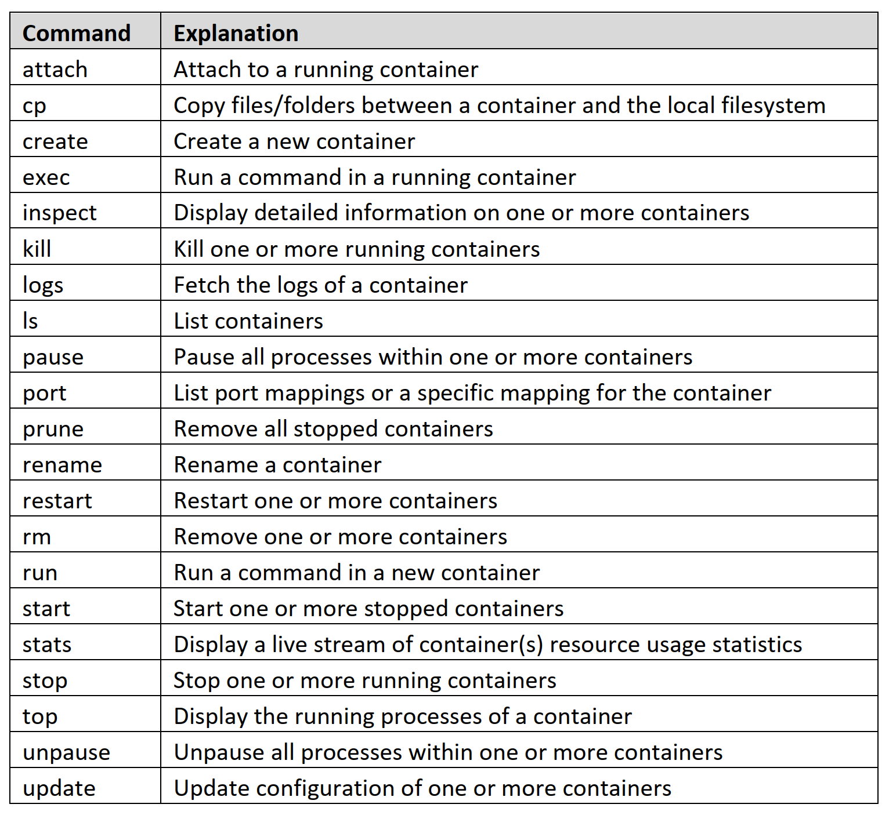

## Docker
- Docker, Inc. – The company
- Docker the technology
- Docker is an open source platform for developing, shipping, and running
applications.
- Docker enables you to separate your applications from your infrastructure
so you can deliver software quickly.
- Docker manages the lifecycle of the container.
- The use of containers to deploy applications is called containerization.
- Developed using Linux core components, in 2013.
- It was developed as an internal project at a platform-as-a-service company called
dotCloud and later renamed as Docker.

## Docker container
Docker containers create an abstraction at the application layer. Containers package your application and its container dependencies with everything it needs to run, including:

- the operating system
- application code
- runtime
- system tools
- system libraries
- etc.

This means that any containerized application can run on any platform regardless of the underlying operating system. We can also think of containers as runtime instances of Docker images.

## Docker modules
Docker offers many different modules and plugins. Let’s take a look at some of the most popular ones.

### Docker Compose
docker-compose allows you to define and run multi-container applications. With Compose, you use a YAML file to configure your app’s services and orchestrate containers on a Docker daemon or on Docker Swarm. You can think of it as an automated multi-container workflow. Docker Compose is great for development, testing, CI workflows, and staging environments.

### Docker Machine
docker-machine allows you to deploy your containerized applications to the cloud. With Docker Machine, you can create a remote virtual machine and manage your containers. It’s a great tool for creating deployment environments and managing micro-services that run on your application. It can be used with popular cloud services such as AWS and Microsoft Azure.

### Docker stack
Docker stack allows you to manage a cluster of Docker containers with Docker Swarm. Docker stack is embedded into the Docker command-line interface (CLI). With stack, you can describe multiple services in a single file. It eliminates the need to maintain bash scripts to define services.

### Docker Swarm
Docker Swarm allows you to manage multiple containers across different host machines. In other words, it’s a container orchestration tool. With Swarm, you can turn multiple Docker hosts into a single host.

## Docker command
- docker container `ls -a`
- docker container `create` nginx
- docker container `create` --name web01 nginx
- docker container `attach` server03
- docker container `exec` server03 cat /etc/resolv.conf
- docker container `stop` server003
- docker container `kill` server003
- docker container `restart` server003
- docker container `inspect` web02 | grep -e "HostPort" -e "IPAddress"
- docker image `rm` nginx centos
- docker container rm `docker container ls -a -q` -f
- docker image rm `docker image ls -q` -f

## Docker Image
- An image is a read-only template with instructions for creating a
Docker container.
- Often, an image is based on another image, with some additional
customization.
- For example, you may build an image which is based on the ubuntu image, but installs the Apache web server and your application, as well as the configuration details needed to make your application run
- We can create custom images using Dockerfile with a simple syntax
for defining the steps needed to create the image and run it.
- Each instruction in a Dockerfile creates a layer in the image.

## Image vs Container
- An image is a read-only filesystem
- A container is an encapsulated set of processes running in a read-write copy of
that filesystem
- To optimize container boot time, copy-on-write is used instead of regular copy
- `docker container run` starts a container from a given image

## What is Dockerfile
- Docker can build images automatically by reading the instructions from a
Dockerfile.
- A Dockerfile is a text document that contains all the commands a user could call
on the command line to assemble an image.
- Using docker image build users can create an automated build that executes
several command-line instructions in succession.

## Docker vocabulary guide
Let’s take a look at some common Docker terms you’ll see when working with the platform.

- `Cgroups`: Control groups allow you to allocate resources among processes running on a system.

- `Container images`: Docker images are files that you use to execute code in a Docker container.

- `Docker build`: docker build is a command that you use to build an image from a Dockerfile.

- `Docker Engine`: Docker Engine is the core product of Docker, which includes its daemon and CLI. It has an API for interacting with the Docker daemon.

- `Dockerfile`: A Dockerfile is a text-based document that holds the instructions for building Docker images.

- `Docker Hub`: Docker Hub is a service that allows you to find and share containers with your organization.

- `Docker Registry`: Docker Registry allows you to store and distribute named Docker images. Registries are organized into repositories, and they hold all of the versions of different images.

- `Docker run`: The run command allows you to create a container from a specified image and start that container using a given command.

- `Namespace`: Namespaces are created when you run a container. They provide a layer of isolation, as each element of a container runs in a different namespace.

- `Pull`: docker pull is a command that allows you to download a specific image or set of images.

- `Repository (repo)`: Docker repositories allow you to share container images with others. These images are stored as tags.

- `Tags`: Docker tags are like labels that you can assign to any completed build.

- `Union filesystem (AUFS)`: A union filesystem layers multiple directories on a single host and presents them as a single directory.

## Docker Desktop 
it is an application that allows you to build and share containerized applications and microservices. According to the Docker documentation, it includes:

- Docker Engine
- Docker CLI client
- Docker Compose
- Docker Content Trust
- Kubernetes
- Credential Helper

## Docker components.
The three architectural components include Docker Client, Host, and Registry.

- `Docker Client`: This component executes build and run operations to communicate with the Docker Host.

- `Docker Host`: This component holds the Docker Daemon, Docker images, and Docker containers. The daemon sets up a connection to the Docker Registry.

- `Docker Registry`: This component stores Docker images. It can be a public registry, such as Docker Hub or Docker Cloud, or a private registry.

## Docker Engine 
it is an open-source containerization technology that we can use to build and containerize our applications. Docker Engine is supported by the following components:

- Docker Engine REST API
- Docker Command-Line Interface (CLI)
- Docker Daemon

