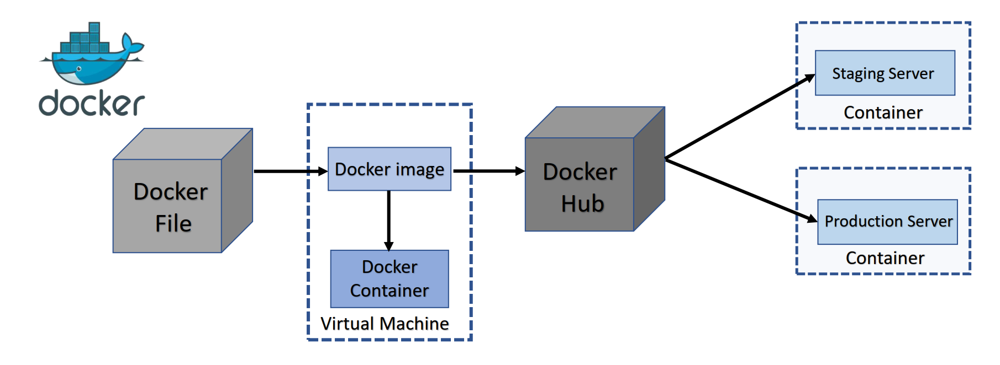

## Docker
- Docker, Inc. – The company
- Docker the technology
- Docker is an open source platform for developing, shipping, and running
applications.
- Docker enables you to separate your applications from your infrastructure
so you can deliver software quickly.
- Docker manages the lifecycle of the container.
- The use of containers to deploy applications is called containerization.
- Developed using Linux core components, in 2013.
- It was developed as an internal project at a platform-as-a-service company called
dotCloud and later renamed as Docker.



## Docker container
Docker containers create an abstraction at the application layer. Containers package your application and its container dependencies with everything it needs to run, including:

- the operating system
- application code
- runtime
- system tools
- system libraries
- etc.

This means that any containerized application can run on any platform regardless of the underlying operating system. We can also think of containers as runtime instances of Docker images.

## Docker modules
Docker offers many different modules and plugins. Let’s take a look at some of the most popular ones.

### Docker Compose
docker-compose allows you to define and run multi-container applications. With Compose, you use a YAML file to configure your app’s services and orchestrate containers on a Docker daemon or on Docker Swarm. You can think of it as an automated multi-container workflow. Docker Compose is great for development, testing, CI workflows, and staging environments.

### Docker Machine
docker-machine allows you to deploy your containerized applications to the cloud. With Docker Machine, you can create a remote virtual machine and manage your containers. It’s a great tool for creating deployment environments and managing micro-services that run on your application. It can be used with popular cloud services such as AWS and Microsoft Azure.

### Docker stack
Docker stack allows you to manage a cluster of Docker containers with Docker Swarm. Docker stack is embedded into the Docker command-line interface (CLI). With stack, you can describe multiple services in a single file. It eliminates the need to maintain bash scripts to define services.

### Docker Swarm
Docker Swarm allows you to manage multiple containers across different host machines. In other words, it’s a container orchestration tool. With Swarm, you can turn multiple Docker hosts into a single host.

## Docker command
- docker container `ls -a`
- docker container `create` nginx
- docker container `create` --name web01 nginx
- docker container `attach` server03
- docker container `exec` server03 cat /etc/resolv.conf
- docker container `stop` server003
- docker container `kill` server003
- docker container `restart` server003
- docker container `inspect` web02 | grep -e "HostPort" -e "IPAddress"
- docker image `rm` nginx centos
- docker container rm `docker container ls -a -q` -f
- docker image rm `docker image ls -q` -f


## Docker Image
- An image is a read-only template with instructions for creating a
Docker container.
- Often, an image is based on another image, with some additional
customization.
- For example, you may build an image which is based on the ubuntu image, but installs the Apache web server and your application, as well as the configuration details needed to make your application run
- We can create custom images using Dockerfile with a simple syntax
for defining the steps needed to create the image and run it.
- Each instruction in a Dockerfile creates a layer in the image.

## Image vs Container
- An image is a read-only filesystem
- A container is an encapsulated set of processes running in a read-write copy of
that filesystem
- To optimize container boot time, copy-on-write is used instead of regular copy
- `docker container run` starts a container from a given image

## What is Dockerfile
- Docker can build images automatically by reading the instructions from a
Dockerfile.
- A Dockerfile is a text document that contains all the commands a user could call
on the command line to assemble an image.
- Using docker image build users can create an automated build that executes
several command-line instructions in succession.

## Docker vocabulary guide
Let’s take a look at some common Docker terms you’ll see when working with the platform.

- `Cgroups`: Control groups allow you to allocate resources among processes running on a system.

- `Container images`: Docker images are files that you use to execute code in a Docker container.

- `Docker build`: docker build is a command that you use to build an image from a Dockerfile.

- `Docker Engine`: Docker Engine is the core product of Docker, which includes its daemon and CLI. It has an API for interacting with the Docker daemon.

- `Dockerfile`: A Dockerfile is a text-based document that holds the instructions for building Docker images.

- `Docker Hub`: Docker Hub is a service that allows you to find and share containers with your organization.

- `Docker Registry`: Docker Registry allows you to store and distribute named Docker images. Registries are organized into repositories, and they hold all of the versions of different images.

- `Docker run`: The run command allows you to create a container from a specified image and start that container using a given command.

- `Namespace`: Namespaces are created when you run a container. They provide a layer of isolation, as each element of a container runs in a different namespace.

- `Pull`: docker pull is a command that allows you to download a specific image or set of images.

- `Repository (repo)`: Docker repositories allow you to share container images with others. These images are stored as tags.

- `Tags`: Docker tags are like labels that you can assign to any completed build.

- `Union filesystem (AUFS)`: A union filesystem layers multiple directories on a single host and presents them as a single directory.

## Docker Desktop 
it is an application that allows you to build and share containerized applications and microservices. According to the Docker documentation, it includes:

- Docker Engine
- Docker CLI client
- Docker Compose
- Docker Content Trust
- Kubernetes
- Credential Helper

## Docker components.
The three architectural components include Docker Client, Host, and Registry.

- `Docker Client`: This component executes build and run operations to communicate with the Docker Host.

- `Docker Host`: This component holds the Docker Daemon, Docker images, and Docker containers. The daemon sets up a connection to the Docker Registry.

- `Docker Registry`: This component stores Docker images. It can be a public registry, such as Docker Hub or Docker Cloud, or a private registry.

## Docker Engine 
it is an open-source containerization technology that we can use to build and containerize our applications. Docker Engine is supported by the following components:

- Docker Engine REST API
- Docker Command-Line Interface (CLI)
- Docker Daemon


### how docker container process id are mapped to the linux kernel
In summary, Docker container processes are mapped to the Linux kernel through the use of PID namespaces and managed by the container runtime, which handles the translation between container PIDs and host kernel PIDs. This allows Docker containers to run isolated from each other and from the host system while still interacting with the underlying Linux kernel.

### how the container process are scheduled on linux kernel can one container process affect the scheduling of other container process
Container processes are scheduled on the Linux kernel just like any other process on the system. The Linux kernel's scheduler is responsible for determining which processes, including container processes, get access to the CPU resources at any given time. Here's how it works:

### How container maps its ip adderess to the linux machine
- `Network Namespace`: Each container runs in its own network namespace, which provides isolation for network resources such as interfaces, routes, and IP addresses. When a container is started, a new network namespace is created for it. This namespace acts as a virtual network stack, separate from the host's network namespace.

- `Virtual Ethernet Interfaces`: Inside the container's network namespace, virtual Ethernet (veth) interfaces are used to connect the container's network stack to the host's network stack. One end of the veth pair is inside the container's network namespace, while the other end is inside the host's network namespace.

- `Bridge Networking`: On the host, a bridge network interface (such as docker0 in Docker) is typically used to connect the veth interfaces of all running containers. The bridge acts as a virtual switch, allowing containers to communicate with each other and with the host.

- `Network Address Translation (NAT)`: When a container sends traffic to the outside world, the Linux kernel performs network address translation (NAT) to map the container's private IP address to the host's IP address. This allows containers to communicate with external networks using the host's IP address.

- `Port Mapping`: In addition to IP address mapping, containers may also use port mapping to expose services running inside the container to the host or to the external network. Port mapping forwards incoming connections on specific ports of the host to corresponding ports on the container.

By using network namespaces, virtual interfaces, NAT, and port mapping, containers can effectively map their IP addresses to the Linux host and communicate with external networks while maintaining isolation and security.x`x`x``

### how the container process are scheduled on linux kernel can one container process affect the scheduling of other container process
Container processes are scheduled on the Linux kernel just like any other process on the system. The Linux kernel's scheduler is responsible for determining which processes, including container processes, get access to the CPU resources at any given time. Here's how it works:

- `Cgroups`: Docker and other container runtimes leverage Control Groups (cgroups) provided by the Linux kernel to manage resource allocation for containers. Cgroups allow the kernel to group processes together and enforce resource limits and policies on those groups. Each container is placed in its own cgroup, allowing the kernel to apply resource controls independently to each container.

- `Scheduler`: The Linux kernel's scheduler is responsible for deciding which processes to run on the CPU cores. It uses scheduling algorithms like the Completely Fair Scheduler (CFS) to allocate CPU time to processes based on their priority, CPU shares, and other factors.

- `Isolation`: Containers provide process isolation by leveraging features provided by the kernel, such as namespaces and cgroups. These features ensure that each container has its own isolated view of the system, including its own filesystem, network, and process namespace. This isolation prevents one container's processes from directly affecting the scheduling or performance of processes in other containers.

- `Fairness`: The Linux kernel's scheduler aims to provide fair access to CPU resources for all processes running on the system, including container processes. It uses various heuristics to ensure that CPU time is distributed fairly among different processes and cgroups.


### does docker run time environment can schedule the docker container processes
Yes, Docker's runtime environment includes a built-in scheduler responsible for managing container processes and allocating resources on the host system. Docker uses a component called the Docker Engine (or Docker Daemon) to manage containers, and this daemon includes a scheduler as part of its core functionality.

The Docker scheduler is responsible for:

- `Scheduling Containers`: When a new container is started or when resources are allocated to an existing container, the Docker scheduler decides which host system should run the container based on factors such as resource availability, container requirements, and scheduling policies.

- `Resource Management`: The scheduler ensures that containers have access to the necessary resources (such as CPU, memory, and storage) based on their resource requests and limits. It also monitors resource usage and may adjust resource allocations dynamically to optimize performance and resource utilization.

- `Load Balancing`: In environments with multiple Docker hosts or a cluster of Docker hosts, the scheduler may perform load balancing by distributing containers across hosts to evenly distribute workload and prevent resource bottlenecks.

- `High Availability`: The scheduler may also support high availability features by automatically restarting failed containers or migrating containers to healthy hosts in case of host failures.

Overall, the Docker scheduler plays a crucial role in orchestrating containerized applications, ensuring efficient resource utilization, high availability, and optimal performance.


### how to copy one file from one cotainer to another container what are the options can be utalized

There are several options to copy a file from one container to another container in Docker:

- `Using Shared Volumes`: If both containers share a volume, you can simply copy the file to the shared volume from the source container and then access it from the destination container. This approach requires that you mount the same volume in both containers.

- `Using docker cp Command`: You can use the docker cp command to copy files or directories between a container and the local filesystem. However, this command doesn't support copying directly between two containers. Instead, you would need to copy the file from the source container to the host filesystem and then from the host filesystem to the destination container.
```code
# Copy file from source container to host filesystem
docker cp <source_container_id>:/path/to/source/file /path/on/host

# Copy file from host filesystem to destination container
docker cp /path/on/host <destination_container_id>:/path/to/destination/directory
```
- `Using docker cp and Shell Pipes`: You can combine docker cp with shell pipes to copy files directly from one container to another without saving them to the host filesystem.

- `Using Docker Compose`: If you are using Docker Compose, you can define services for both containers in the docker-compose.yml file and then use volumes to share files between them.

- `Using Network File Sharing`: You can set up network file sharing solutions like NFS or Samba to share files between containers running on different hosts.


### Explain the difference between Docker container and Docker image.
### How does Docker handle networking between containers?
### Explain the difference between Docker volumes and bind mounts.
### What is Docker Compose, and how is it used?
### What are the main components of a Dockerfile, and how do you use them?
### How does Docker handle secrets management?
### What is Docker Swarm, and how does it compare to Kubernetes?
### Explain how you would troubleshoot a Docker container that is not starting up correctly.
### What are the security best practices for Docker containers?
### Explain Docker layer caching and how it can affect build times.
### How does Docker differ from virtualization?
### What is Docker's role in a microservices architecture?
### Explain the concept of a Docker registry and its importance.
### How would you optimize Docker container images for size and performance?
### Discuss the differences between Docker Swarm mode and Docker standalone mode.
### Explain how you would deploy a multi-container application using Docker Compose.
### What are the differences between Docker Community Edition (CE) and Docker Enterprise Edition (EE)?
### How do you monitor Docker containers and their resource usage?
### What is Docker Content Trust, and why is it important?
### Explain how you would scale Docker containers horizontally and vertically.

