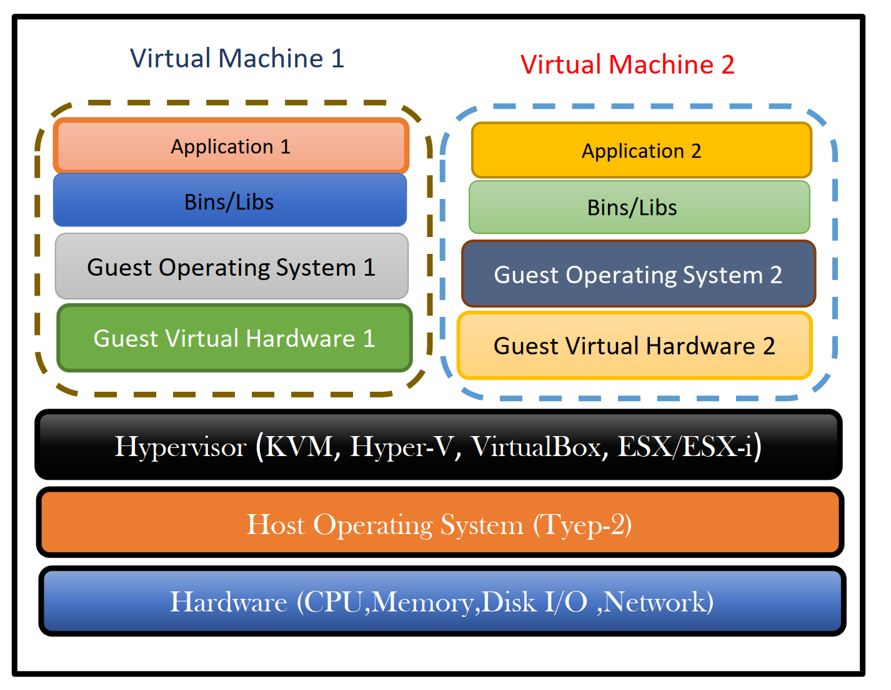
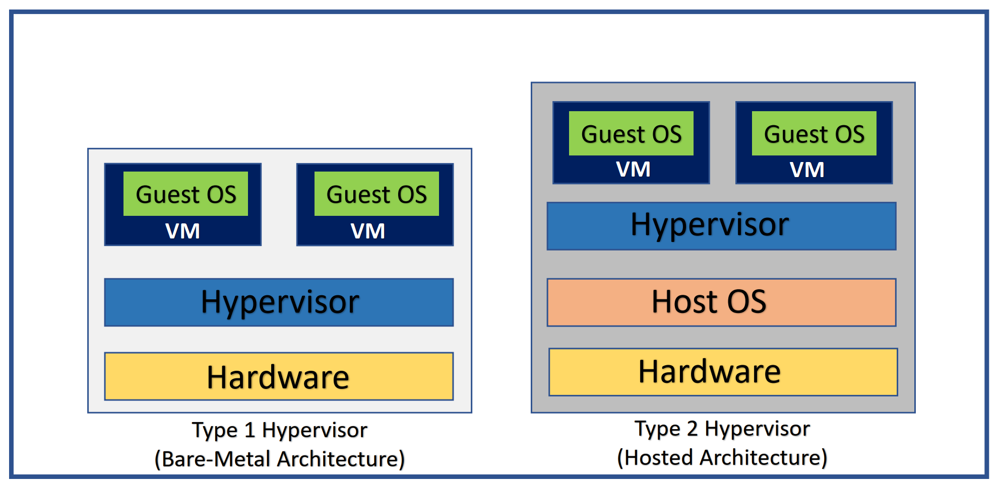
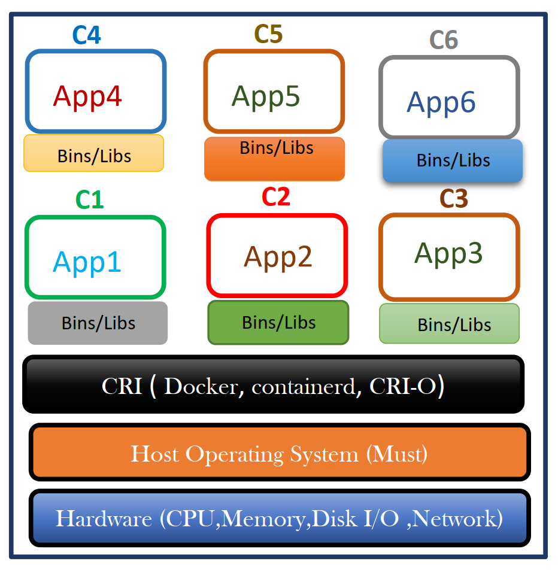
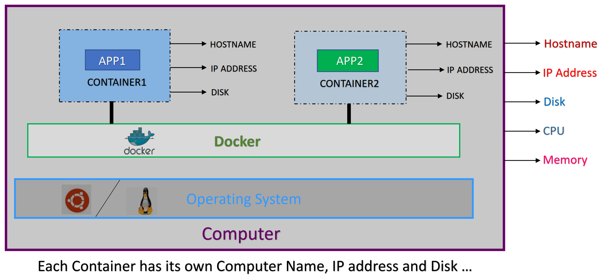
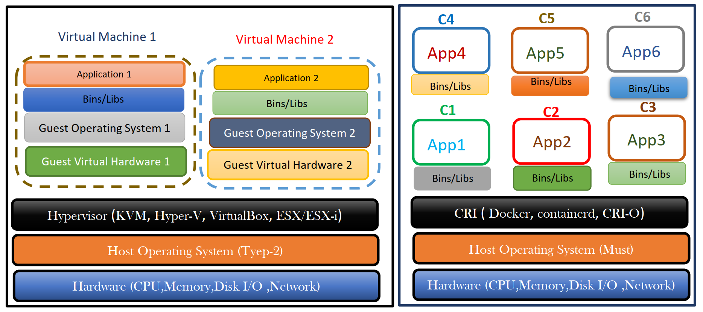
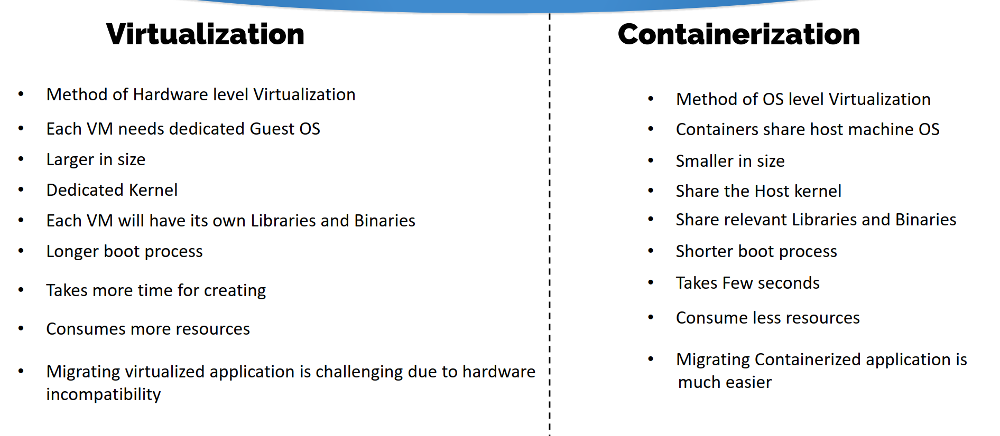

### Type of infrastructure
- Bare Metal Infrastructure
- Virtualized Infrastructure
- Containerized Infrastructure

Bare-metal servers are 'physical' servers. Which is a single-tenant physical server.

### Disadvantages of Bare-Metal Servers

- One-App One-Server
- More expensive (hardware level)
- Mis-match of capacity
- Expensive maintenance

## Virtualization
- Virtualization is the technique of virtualizing the
underlying Infrastructure, such as Memory, CPU,
Storage…
- Guest operating systems run on top of a Host
operating system (Hypervisor)
- We can run different flavors of operating systems in
different virtual machines all running on the same
Infrastructure.
- Virtualization eliminates the need for extra
hardware resource.

## Hypervisors
A hypervisor allows one host computer to support multiple guest VMs by virtually sharing its resources, such as Memory, CPU and Storage.

### Types of Hypervisor
- `Type-1 Hypervisors` – Runs directly on top of Hardware. KVM, Xen, Hyper-V, ESX/ESXi…
- `Type-2 Hypervisors` – Runs on top of Host OS Oracle VB, VMware Workstation…

### VMs are great, but they’re far from perfect!
- Each guest OS will have its own kernel and set of libraries and dependencies.
- Since each VM includes an OS and a virtual copy of all the hardware the OS requires, VMs
require significant RAM and CPU resources.
- VMs incur a lot of overhead beyond what is being consumed by your application logic.
- Since each VM has its own dedicated OS, License cost is involved.
- Patching, Upgrades, Security, Hardening requires larger team and time.
- Boot up process is longer and takes more time

### Containerization
- Containers are a method of operating system
level virtualization.
- Containers allow you to run an application and
its dependencies in resource-isolated processes.
- No guest OS overhead and utilizes a host’s
operating system.
- Containers share relevant OS libraries &
resources as and when needed unlike virtual
machines.
- Containers are Lightweight and Faster than
Virtual Machines.

## What is Container
A container is the same idea as a physical container—think of it like a box with an application in it.

## Virtualization vs Containerization

